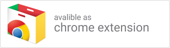

<h1 align="center">
   
   
  Freeze - New Tab Page Extension
   
</h1>

<h4 align="center">A Curated Cinemagraph Each Time You Open a New Tab</h4>

  

 

  
  
   
  
  

<i>Cinemagraphs are still photographs in which a minor and repeated movement occurs,   forming a perfectly  looping video.</i>
 

## Features

🎆 300+ Curated Cinemagraphs

🕑 12h clock, 24h clock, analog clock or no clock

🕶️ Image filters to unify cinemagraphs style

⏲ New Cinemagraph `every time`, `5min`, `15min`, `30min`, `hourly` or `daily`

## How to install

You can install Freeze from the [Chrome web store](https://chrome.google.com/webstore/detail/kacdbklgelcjnoejpbafhdelhlnkgpnd)

 
## Contribute

Found a nice looking Cinemagraph? Add it to [cinemagraphs.json](https://github.com/Hemmingsson/Freeze/blob/master/cinemagraphs.json) and create a pull request.

## Reporting bugs

If you find any bugs or want to provide feedback, you can file bugs in the project's [GitHub Issues page](https://github.com/Hemmingsson/Freeze/issues).

## Dev Environement
### Installation
1. Clone the repository `git clone https://github.com/Hemmingsson/Freeze`
2. Run `npm install`
3. Run `npm run build`

##### Load the extension in Chrome
1. Open Chrome browser and navigate to chrome://extensions
2. Select "Developer Mode" and then click "Load unpacked extension..."
3. From the file browser, choose to `Freeze/build/chrome`

### Developing
The following task can be used when you want to start developing the extension

- `npm run chrome-watch`

## Credits

### Freeze was made with :

- [Extension Boilerplate](https://github.com/EmailThis/extension-boilerplate)
- [instagram.css](https://github.com/picturepan2/instagram.css)
- Cinemagraphs sourced from [imgur.com](https://imgur.com) and [r/Cinemagraphs](https://www.reddit.com/r/Cinemagraphs/)

## License

Freeze is released under the [MIT License](https://github.com/Hemmingsson/Freeze/blob/master/LICENSE).

---

